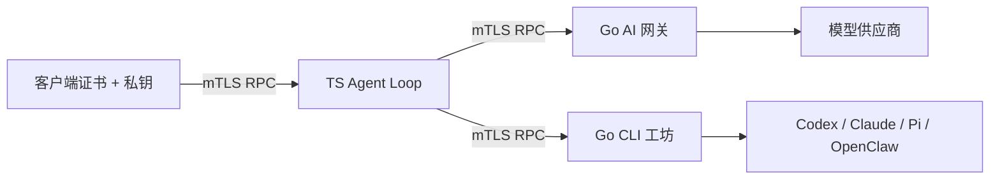

# EasyGo Agent 集群

EasyGo 是一个可以快速部署的**通用 Agent 集群基础版**，只负责 Agent 的运行、通信、协作、质量和交付，不负责具体业务。使用者在它上面加一个 Agent 包（角色、工作流、技能、工具、验收检查），就能改造成专用 Agent。

目前已经完成的是"运行"和服务间通信：下面的三个服务和托管平台。协作、质量闸、交付和 Agent 包还在设计阶段，见[定位与设计草案](doc/agent-cluster-design.md)。

## 快速开始（Docker Compose 一键部署）

需要 Linux 上的 Docker Engine 和 Docker Compose v2（建议 2.20 以上）。

```bash
cp .env.example .env
# 编辑 .env：填 DEEPSEEK_API_KEY 和 EASYGO_ADMIN_PASSWORD（至少 12 个字符）
docker compose up -d --build
```

第一次构建要下载 Go 模块、npm 包和四个 CLI，任务镜像约 2 GB，需要几分钟。启动后：

1. 浏览器打开 <http://localhost:8090>，用 `.env` 里的管理员邮箱（默认 `admin@example.com`）和密码登录。服务器在远程时先开隧道：`ssh -L 8090:127.0.0.1:8090 <服务器>`。
2. 在「管理」页给自己发放额度（默认每 1000 token 1 积分），然后就可以对话、提交工坊任务。
3. 要给别人用：`.env` 里设 `EASYGO_REGISTRATION=true`，再执行一次 `docker compose up -d`。新用户余额为 0，由管理员发放额度。

`docker compose up` 每次都会先运行一次性的 `init` 容器，由它根据 `.env` 生成三个服务的配置和内部证书，所以改设置只需改 `.env` 再 `up` 一次。数据库、证书和任务工作区都在 `./state/platform`（`EASYGO_DATA_DIR`），要作为整体备份。

| 常用操作 | 命令 |
|---|---|
| 状态 / 日志 | `docker compose ps`、`docker compose logs -f agent-loop` |
| 停止 / 启动 | `docker compose stop`、`docker compose start` |
| 更新代码后 | `git pull && docker compose up -d --build` |
| 删除容器（保留数据） | `docker compose down` |

工坊通过 Docker socket 启动任务容器，拿到 socket 就等于拿到宿主 root，生产环境最好给平台单独一个 daemon（`EASYGO_DOCKER_SOCKET`）。HTTPS 与反向代理、对账、备份和隔离限制见[托管平台运维](doc/platform-operations.md)。

## 三个服务

三个可以分别部署的服务，通过 **JSON-RPC over HTTPS + 双向 TLS** 调用。每个服务拥有自己的私钥；对端根据公钥证书确认身份，再检查方法和 namespace 权限。

| 服务目录 | 语言 | 职责 |
|---|---|---|
| [`services/ai-gateway`](services/ai-gateway) | Go | 模型协议映射、流式输出、用量、计价与观测 |
| [`services/agent-loop`](services/agent-loop) | TypeScript | 会话、持久队列、模型/工具循环、压缩、取消与历史 |
| [`services/workshop`](services/workshop) | Go | 可选 Agent 框架、模型复用、工作区、原生会话续跑与产物 |



Loop 不加载网关或工坊的运行实现，不共享它们的数据库，也不持有模型供应商密钥。Go 的公共传输代码在 `packages/rpc-go`，只在构建时复用，不是第四个服务。

工坊现可独立选择 Codex、Claude Code、Pi、OpenClaw，并引用主网关中的模型配置；支持第三方 API。见 [框架选择与 DeepSeek 接入](doc/workshop-runtimes.md)。

## 托管平台

`compose.yaml` 把三个服务部署成多用户平台（见上面的快速开始），对外只暴露 Web：

- **Web 与账户**：注册/登录、会话与历史、工坊任务与产物下载、记忆与技能、钱包与用量；管理员发积分、改费率、处理待核对用量。见 [platform-web.md](doc/platform-web.md)。
- **按 token 计费**：网关在调用供应商前按保守估计预留积分，结算走持久 outbox，恰好扣一次；用量未知时冻结等待管理员对账，不会静默免单。默认输入 + 输出每 1000 token = 1 积分。
- **任务容器**：工坊每次执行都起一个独立容器，无网络、只读根文件系统、非 root、资源受限，只挂本任务工作区和本次执行的模型转发 socket。
- **记忆与旧终端**：独立 Knowledge 库（八类记忆、技能按需加载），旧 Bubble Tea 界面通过 `cmd/easygo-remote` 登录平台使用。见 [platform-knowledge.md](doc/platform-knowledge.md)。Web 是唯一的主控制台，这个 CLI 只给个人用，定位见 [CLI 说明](doc/cli.md)。

部署、HTTPS、对账、故障恢复、备份与隔离限制见 [托管平台运维](doc/platform-operations.md)，验收记录见 [platform-verification.md](doc/platform-verification.md)。

## 部署与调用（仅三服务 RPC）

详细步骤、密钥挂载、环境变量和数据卷见 [服务部署说明](services/README.md)。首次启动：

```bash
scripts/dev-pki.sh ./state/pki
# 按服务说明复制并填写各自配置、模型 ID、工作流和凭证环境。
docker compose -f compose.services.yaml up --build -d
```

默认只映射宿主 `127.0.0.1:8441/8442/8443`，不提供明文或 Bearer 降级。`scripts/rpc-call.mjs` 是带双向证书校验和服务端固定证书校验的客户端。[RPC 契约](contracts/rpc-v1.md)列出全部方法。

## 设计来源

Agent Loop 主要参考 reference agent A 的 TypeScript 组织方式：类型化消息、异步工具循环、明确的提交时点。reference agent B 当前 Python agent loop 的 transcript 顺序也被采用：完整模型输出先记录，工具结果记录后再推进；没有复制它的旧 LangGraph 路径或业务适配代码。

网关和工坊保留上一轮已验证的 Go 核心，实现移动到各自目录。每个服务有独立依赖清单、启动入口、配置和 Dockerfile，分别测试、构建和发布。

## 验证

```bash
# Go 在 PATH 中；或者给端到端脚本设置 EASYGO_GO_BIN。
(cd packages/rpc-go && go test -race ./... && go vet ./...)
(cd services/ai-gateway && go test -race ./... && go vet ./...)
(cd services/workshop && go test -race ./... && go vet ./...)
npm --prefix services/agent-loop ci
npm --prefix services/agent-loop run typecheck
npm --prefix services/agent-loop test
node --test scripts/rpc-call.test.mjs
node scripts/test-services.mjs
```

端到端脚本实际启动三个独立进程和本机 TLS 连接，验证权限、工坊子进程产物、幂等、取消和崩溃恢复；模型和 CLI 响应使用本机夹具，不调用付费模型。Docker 镜像/容器验证状态另见 [验收记录](doc/independent-services-verification.md)。

## 从原 Go 应用迁移

原 `cmd/easygo-agent`、Go 本地循环及既有数据库仍保留用于过渡与回归，`go test ./...` 验证它们。它们不参与新的三服务部署；旧 HTTP/Bearer 客户端不能直接调用新 RPC 端口。旧用法见 [历史说明](doc/legacy-local-app.md)。

新 TS 服务使用自己的 SQLite 数据库，不自动转换旧 PostgreSQL/Eino 历史。已开始但中断的任务不自动重放副作用；CLI 执行策略与每任务 OS 沙箱也不是同一层权限。
