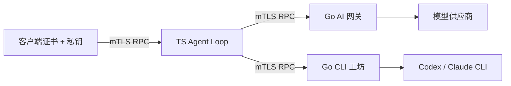

# EasyGo RPC Services

三个可以分别部署的服务，通过 **JSON-RPC over HTTPS + 双向 TLS** 调用。每个服务拥有自己的私钥；对端根据公钥证书确认身份，再检查方法和 namespace 权限。

| 服务目录 | 语言 | 职责 |
|---|---|---|
| [`services/ai-gateway`](services/ai-gateway) | Go | 模型协议映射、流式输出、用量、计价与观测 |
| [`services/agent-loop`](services/agent-loop) | TypeScript | 会话、持久队列、模型/工具循环、压缩、取消与历史 |
| [`services/workshop`](services/workshop) | Go | CLI 任务、工作区、原生会话续跑、产物与结果分页 |



Loop 不加载网关或工坊的运行实现，不共享它们的数据库，也不持有模型供应商密钥。Go 的公共传输代码在 `packages/rpc-go`，只在构建时复用，不是第四个服务。

## 部署与调用

详细步骤、密钥挂载、环境变量和数据卷见 [服务部署说明](services/README.md)。首次启动：

```bash
scripts/dev-pki.sh ./state/pki
# 按服务说明复制并填写各自配置、模型 ID、工作流和凭证环境。
docker compose -f compose.services.yaml up --build -d
```

默认只映射宿主 `127.0.0.1:8441/8442/8443`，不提供明文或 Bearer 降级。`scripts/rpc-call.mjs` 是带双向证书校验和服务端固定证书校验的客户端。[RPC 契约](contracts/rpc-v1.md)列出全部方法。

## 设计来源

Agent Loop 主要参考 reference agent A 的 TypeScript 组织方式：类型化消息、异步工具循环、明确的提交时点。reference agent B 当前 Python agent loop 的 transcript 顺序也被采用：完整模型输出先记录，工具结果记录后再推进；没有复制它的旧 LangGraph 路径或业务适配代码。

网关和工坊保留上一轮已验证的 Go 核心，实现移动到各自目录。每个服务有独立依赖清单、启动入口、配置和 Dockerfile，分别测试、构建和发布。

## 验证

```bash
# Go 在 PATH 中；或者给端到端脚本设置 EASYGO_GO_BIN。
(cd packages/rpc-go && go test -race ./... && go vet ./...)
(cd services/ai-gateway && go test -race ./... && go vet ./...)
(cd services/workshop && go test -race ./... && go vet ./...)
npm --prefix services/agent-loop ci
npm --prefix services/agent-loop run typecheck
npm --prefix services/agent-loop test
node --test scripts/rpc-call.test.mjs
node scripts/test-services.mjs
```

端到端脚本实际启动三个独立进程和本机 TLS 连接，验证权限、工坊子进程产物、幂等、取消和崩溃恢复；模型和 CLI 响应使用本机夹具，不调用付费模型。Docker 镜像/容器验证状态另见 [验收记录](doc/independent-services-verification.md)。

## 从原 Go 应用迁移

原 `cmd/easygo-agent`、Go 本地循环及既有数据库仍保留用于过渡与回归，`go test ./...` 验证它们。它们不参与新的三服务部署；旧 HTTP/Bearer 客户端不能直接调用新 RPC 端口。旧用法见 [历史说明](doc/legacy-local-app.md)。

新 TS 服务使用自己的 SQLite 数据库，不自动转换旧 PostgreSQL/Eino 历史。已开始但中断的任务不自动重放副作用；CLI 执行策略与每任务 OS 沙箱也不是同一层权限。
