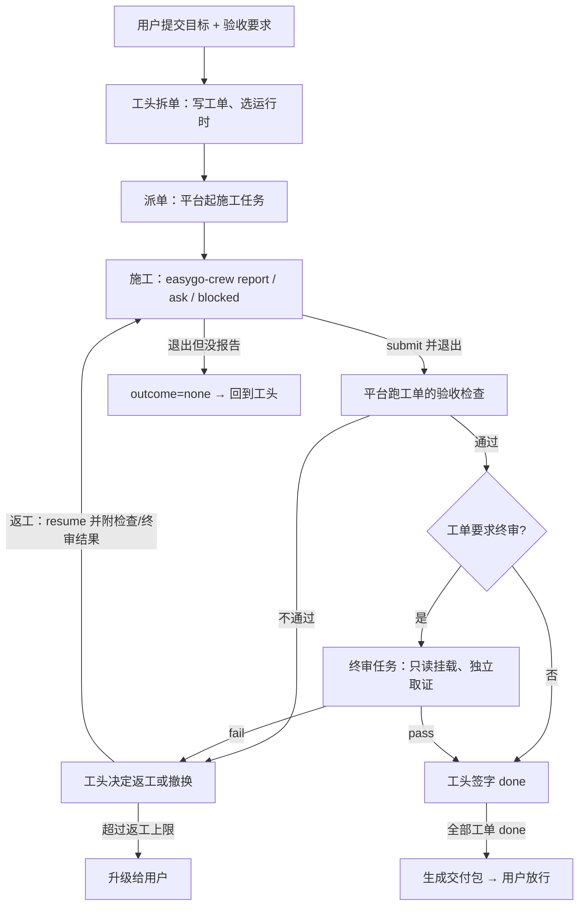

# EasyGo 通用 Agent 集群：定位与设计（草案 v2）

状态：草案 v2，已吸收 2026-09-29 的审阅意见（见 §12）。基线是 `80f2b1d`，即 2026-09-28 推送的托管平台。开工顺序见 §11；设计有改动时先改本文，再改代码。

## 1. 定位

EasyGo 是一个**可以快速部署的通用 Agent 集群基础版**。它只负责 Agent 工作中与具体业务无关的部分：

| 负责 | 含义 |
|---|---|
| 运行 | 把 Agent 放进隔离环境里跑起来，崩溃可恢复，任务可续跑、可取消 |
| 通信 | 服务之间、Agent 之间、Agent 与人之间的消息，每条都有回执 |
| 协作 | 多个 Agent 分工完成一件事：拆单、派单、施工、复审、返工、交接 |
| 质量 | 结果由平台自己取证验收，不采信施工者自报 |
| 交付 | 把通过验收的产物、证据和报告打包，经人放行后交出去 |

**不负责**：
- 具体业务领域，比如素材、视频、营销；
- 收费经营，这部分作为可选模块；
- 绑定某个模型或某个 CLI。

使用者在它上面加一个 **Agent 包**（角色、工作流、技能、工具、验收检查），就能把它改造成专用 Agent，不需要 fork 平台代码（见 §8）。

EasyGo 与 reference agent A、reference agent B 没有依赖关系，只借鉴了在它们上面积累的经验。§5 的协作模型来自实际运行多 Agent 班子（crew）的做法。

## 2. 现状对照

> 本节记录的是 P1 开工前（09-29）的状态。P1 做完的部分见 `doc/p1-verification.md`。

| 职责 | 已有 | 缺口 |
|---|---|---|
| 运行 | 每次执行一个容器：无网络、只读根文件系统、非 root，有资源与磁盘配额；支持崩溃恢复和续跑；一小时压测 0 失败 | 已知一个低概率竞态：取消和退出同时发生时，超额任务可能以 cancelled 结束并登记产物 |
| 通信 | 三个服务之间用 mTLS RPC，按证书限定可调用的方法和 namespace | **Agent 与 Agent 之间没有任何通道**；容器里的 CLI 在运行中既不能汇报也不能提问 |
| 协作 | 无。loop 的一次 run 只能往工坊提交彼此独立的任务 | 角色、任务板、派单、复审、返工、交接都没有 |
| 质量 | 无。工坊判定"成功"只看 CLI 正常退出、声明的产物存在 | 没有验收检查、终审和证据；oracle 只是仓库里的测试脚本 |
| 交付 | 产物登记、下载、sha256 校验 | 没有"验收通过才交付"，没有放行，也不能对外推送 |
| 扩展 | 工作流、运行时、系统提示词、技能都是配置 | loop 的工具写死在 `services/agent-loop/src/tools.ts`（calculator 和 7 个 workshop 工具），加工具要改源码 |
| 界面 | Web：注册登录、会话列表与历史、运行状态与取消、工坊任务与产物、记忆、技能、钱包、管理。远程 TUI：单会话对话、取消、按参数重连 | 没有班子看板（见 §9） |
| 部署 | Compose 部署已验证 | 需要专用 daemon、构建 4 个镜像、生成配置与证书、设环境变量、初始化管理员，称不上"快速" |

超出基础版范围的有两块：
- **钱包、积分、公开注册、对账**：改成多租户模式下的可选模块，代码保留（§10）。
- **旧 Go 本地应用**：约 2.3 万行，占全部代码三分之二，和新架构重复了记忆、技能、沙箱、队列、TUI，计划移出主干（§10）。

## 3. 设计原则

1. **先把单个 Agent 的 harness 做可靠，再在上面叠协作。** 协作的每一步（派单、报审、验收、返工）都建立在"一个 Agent 能被可靠地启动、听到、判定和检查"之上。
2. **平台就是秘书。** 协作里能确定性完成的职能都由平台代码完成，不交给模型：传话、记账、查岗、归档。模型只做需要判断的事：拆单、施工、复审、签字。
3. **只认自己取的证。** 验收结论只来自平台运行的检查和独立终审。施工者说"已通过"不作数。
4. **星型通信，全程回执。** 施工者只和工头通信，施工者之间不可寻址。消息落库即送达，平台上不存在"不知道对方收没收到"的状态。
5. **服务边界不变。** 协作状态放在 loop，工坊只负责执行，网关只负责模型。**不新增信任边**：工坊不回调 loop，loop 继续用已有的 `workshop.events` 拉取。
6. **业务内容都在包里。** 角色说明、工作流、检查、技能、工具都是 Agent 包的内容，不写死在平台代码里。

## 4. Harness：让单个 Agent 可靠干活

Harness 指模型之外、让 Agent 能可靠干活的那一层：循环、工具、提示词、上下文、执行环境、通信、结束判定、检查与证据、观测和自测。EasyGo 里有两种 harness：

- **工头**的 harness 就是 TS loop，由 EasyGo 自己实现。
- **施工者和终审**的内核是第三方 CLI（Codex、Claude Code、Pi、OpenClaw），循环和工具由 CLI 自带。EasyGo 负责包在外面的那一层：容器、模型转发、入职说明、通信命令、结束判定和检查。

| 部件 | 工头（TS loop） | 施工者 / 终审（工坊） | 阶段 |
|---|---|---|---|
| 循环与触发 | 已有模型-工具循环。run 目前只由用户消息触发，要增加由班子事件触发 | CLI 自带 | P2 |
| 工具 | 写死的数组改成注册表，按角色分配工具，删掉 calculator | CLI 自带，另加 `easygo-crew` | P1 |
| 提示词 | 一个全局 `system_prompt` 改成按角色从包里加载 | 工坊把工作流说明、工单和入职说明拼成输入 | P1 |
| 上下文 | 已有压缩。长作业以任务板为准，每次唤醒都重读板面，不依赖对话记录 | CLI 自带，续跑沿用原生会话 | P2 |
| 执行环境 | 进程内 | 已有隔离容器；修复取消/退出竞态 | P1 |
| 通信 | 读取施工者消息 | `easygo-crew` 命令，见 §5.3 | P1 |
| 结束判定 | — | 退出码之外，再判定是否已报审、已报卡住、在等回复，还是没有报告 | P1 |
| 检查与证据 | — | 检查容器加证据，见 §6 | P1 |
| 观测 | 已有 run 事件 | 已有任务事件。要合成班子统一时间线：消息、检查、状态变化 | P2 |
| 自测 | 夹具模型场景库：每种协作场景和故障场景各一个确定性用例；每个阶段另跑真实模型样本 | 同左 | P1 起 |

**兼容性**：工坊任务现有的状态值（queued … interrupted）不变。另加两个字段：
- `outcome`：submitted / blocked / asked / none；
- `acceptance`：pending / passed / failed / skipped。

现有客户端不受影响。

## 5. 协作模型（crew）

### 5.1 概念映射

| crew 里的做法 | 平台实现 |
|---|---|
| 班子 | `crew` 对象；用户每提交一个作业就建一个 |
| 工头 | loop 里的一个会话，默认路由到强推理模型，可以在包里换；工具换成班子工具（§5.6） |
| 施工 | 一个工坊任务，即容器里的 Codex / Claude Code / Pi / OpenClaw |
| 终审 | 一个工坊任务，**只读挂载**被审工单的工作区，自己跑命令取证 |
| 秘书 | 平台本身（原则 2） |
| 任务板、五节施工图 | loop 数据库里的工单：现场、修法、明令不做、测试、交付，另加验收检查 |
| 消息与回执 | 容器内的 `easygo-crew` 命令 → 本次执行专属的转发通道 → 工坊任务事件 → loop |
| 查岗、停手必报 | 任务退出时没有报告，平台直接产生事件，不需要点名巡检 |
| 绩效档案 | 按成员记录，按"运行时 × 模型"汇总成质量画像 |
| 交接 | 撤换时，平台用工作区改动和消息记录生成五节交接 |

### 5.2 一次作业的流程



- **写工单和签字只归工头**（review → done），平台拒绝其他角色做这两类操作。
- **返工上限**：默认每单 2 次，超过就升级给用户。这对应 crew 里"同单连续两次返工仍不合格"的判例。
- **施工图有疑议就停下来问**：施工者用 `easygo-crew ask` 提问后可以退出等回复。工头回复后，平台把回复当作 resume 输入，续跑同一个任务。

### 5.3 通信

- **可达关系**：施工者和终审只能和工头通信；用户通过 Web 或 TUI 会话和工头对话。平台拒绝施工者给其他成员发消息。
- **通道**：任务容器的 PID 1（task-shim）已经把 `127.0.0.1:18080` 转发到本次执行专属的 Unix socket。改动如下：
  - 在这条通道上新增 `/crew/*` 路径；
  - 任务镜像里加 `easygo-crew` 命令，调用这些路径。

  每次执行一个 socket，socket 本身就是身份，施工者无法冒充别人。用命令做所有 CLI 共用的接口；支持 MCP 的 CLI 以后可以再包一层 MCP。
  Docker 模式下四种 CLI 都有 shell：Codex 自带，Claude、Pi、OpenClaw 分别开放 `Bash`、`bash`、`exec`，由外层容器负责隔离（P1 W-4）。host 模式下工具白名单不是 OS 隔离，所以不开放 shell，只有 Codex 能用 `easygo-crew`。
- **子命令**：
  - `report`：进度；
  - `ask`：提问；
  - `blocked`：卡住，附原因；
  - `submit`：报审，附自报的测试结果；
  - `inbox`：拉取未读消息。
- **回执**：每条消息都有 id。平台落库即送达，工头读取即已读。施工者用 `inbox` 能看到自己的消息已送达。
- **工头发给施工者**：运行中的 CLI 没法被插话，所以消息先进收件箱。
  - 施工者还在跑：它自己用 `inbox` 拉取。
  - 施工者已停：下次 resume 时把未读消息作为输入带进去。
  - 要它立刻停下：只能取消任务。
- **拉取方向**：工坊把施工者消息记成任务事件；loop 用已有的 `workshop.events` 拉取，再把消息排进工头会话的队列，唤醒工头。工头是事件驱动的。
- **用户可见**：Web 显示任务板、消息流、证据和各成员状态，就是 crew 的看板。

### 5.4 查岗

- **退出但没报告**：施工任务结束时既没有 `submit` 也没有 `blocked`，就记 `outcome=none`。工单交回工头，绩效记一笔负项。
- **长时间静默**：超过配置时长（默认 15 分钟）没有消息也没有输出，平台产生 `silent` 事件交给工头，由工头决定催办、取消还是撤换。
- **工头自己中断**：由现有的 run 恢复机制兜底。班子状态都在数据库里，工头恢复后重读任务板即可。

### 5.5 绩效与撤换

- **负项**：
  - 假绿：自报通过，但平台检查失败；
  - 返工；
  - 退出但没报告；
  - 越权，比如试图改检查脚本或给别人发消息。
- **正项**：
  - 主动报卡点；
  - 指出施工图漏洞；
  - 顶回工头的错误判断。

  只记过错会养出只会点头的施工者，所以正负都记。
- **质量画像**：按"运行时 × 模型"汇总，工头派单选运行时的时候可以查。
- **撤换**：
  1. 取消任务。
  2. 平台根据工作区改动、消息记录和检查结果生成五节交接。
  3. 工单回到 todo。
  4. 新施工者的输入附上交接。

  如果是因为假绿撤换，交接标"需复核"。

### 5.6 工头工具

这些工具替换现在写死的 `calculator` 和 `workshop_*`，只给工头会话。

| 工具 | 作用 |
|---|---|
| `crew_card_create` / `crew_card_update` | 写工单：五节、验收要求、是否需要终审 |
| `crew_dispatch` | 给工单派一个施工者，指定运行时 |
| `crew_inbox` / `crew_send` | 读施工者消息 / 回复 |
| `crew_signoff` / `crew_rework` | 签字 / 返工（附原因） |
| `crew_replace` | 撤换施工者 |
| `crew_board` / `crew_evidence` / `crew_profile` | 查看任务板 / 证据 / 质量画像 |
| `crew_deliver` | 生成交付包，提交给用户放行 |

原来的 `workshop_*` 留在平台内部，作为这些工具的底层调用。班子会话里不再把它们直接交给模型；普通单 Agent 会话继续可以用。

### 5.7 数据（loop 数据库新增）

| 表 | 内容 |
|---|---|
| `crews` | 班子：namespace、工头会话、状态、上限 |
| `crew_members` | 成员：角色、运行时、模型、对应的工坊任务、状态（active / suspended / replaced / left） |
| `crew_cards` | 工单：五节、验收定义、指派、状态（todo / doing / review / rework / done / escalated）、返工次数 |
| `crew_messages` | 消息：发件人、收件人、类型、正文、送达时间、已读时间 |
| `crew_evidence` | 证据：检查名、退出码、输出摘要、工作区快照哈希、时间 |
| `crew_handoffs` / `crew_hr` | 交接记录 / 绩效记录 |

### 5.8 限额

- P2 做成员上限（默认 6）、每单返工上限、工头每次唤醒的步数上限。
- 班子 token 预算放到 P5，和积分一起做。在那之前，由用户余额兜底。

## 6. 质量

工作流和工单都可以带 `acceptance`：

```json
{
  "artifacts": ["src/**", "README.md"],
  "checks": [
    { "name": "unit", "command": ["/pack/checks/unit.sh"], "timeout_seconds": 300 }
  ],
  "review": { "runtime": "codex-responses", "instructions": "roles/reviewer.md" }
}
```

- **检查在新容器里跑**：工作区只读挂载，没有网络，也没有模型转发。结果只看退出码，输出截断后存为证据。
- **检查脚本是受信内容**：从包目录只读挂进检查容器，不在施工者的工作区里，所以施工者改不了检查来让自己通过。
- **状态分开**：
  - run 的 `succeeded` 只说明 CLI 正常结束，工坊任务的 `acceptance` 才说明检查结果。
  - 工单要经过"review → 检查 →（终审）→ done"才算完成。
- **证据**：每次检查都记录命令、退出码、输出摘要和工作区快照哈希，随交付包一起交出。
- **假绿识别**：`submit` 时自报的测试结果和平台检查结果不一致，就记为假绿。

## 7. 交付

- **交付包**：包含通过验收的产物、全部证据、工头写的汇总报告和用量。交付包不可变，按哈希寻址，在现有的产物下载上扩展。
- **放行闸，默认开启**：用户在 Web 上点"放行"之后，作业才算交付完成。对应 crew 里"未放行绝不 push"。
- **对外通道**（P3）：
  - git：推到新分支，不推主干；
  - webhook。

  两者都由控制器侧执行，任务容器仍然没有网络。

## 8. 扩展：Agent 包

```
packs/<name>/
  pack.json            # 名称、版本、需要的运行时
  roles/foreman.md     # 工头：拆单与验收原则
  roles/worker.md      # 施工者入职说明
  roles/reviewer.md    # 终审说明
  workflows/*.json     # 工作流：说明、策略、产物、验收
  checks/*             # 验收脚本（受信，只读挂入检查容器）
  skills/*/SKILL.md    # 技能，进 Knowledge 按需加载
  tools/*.json         # 追加给工头的工具（P4，MCP）
```

- **P1** 先做出 `base` 包的三份角色说明和通用检查，平台按角色加载。
- **P4** 定型包格式，并做一个示例专用包。
- **专用化**：新增一个包，或者覆盖 `base` 里的部分文件，不改平台代码。
- **工头模型**：默认是强推理模型，包里可以换。

## 9. 界面

- **Web 是唯一的主控制台。** 班子看板、消息、证据、放行按钮只做在 Web 上，多人使用都走 Web。
- **CLI 保留，只给个人用。** 登录者本人在终端里使用自己的会话、任务、记忆和技能。CLI 不做管理、钱包管理，也不做班子的看板、消息、证据和放行。
- **CLI 已与旧应用断开**（`58f57f6`）。CLI 现在只由 `internal/tui`、`internal/remotetui` 和新的 `internal/clientapi`（运行队列接口、run 记录、运行事件等共用声明）组成；旧应用的 `agentruntime`、`conversation` 改用类型别名引用这些声明，任务列表通过 `internal/app` 里的适配器接入。P5 移除旧应用时 CLI 不受影响，`TestCLIDependsOnlyOnClientPackages` 防止回退。`--rpc` 只接受 10 个记忆/技能方法。说明见 [cli.md](cli.md)。

## 10. 部署与模式（P5）

- **两种模式**：

  | 模式 | 默认 | 账户 | 钱包 | 用量 |
  |---|---|---|---|---|
  | `single` | 是 | 单用户或小团队，没有公开注册 | 无 | 照记 |
  | `multi` | 否 | 现在的注册与管理员体系 | 积分、费率、对账 | 照记 |

- **一条命令部署**：`scripts/easygo up` 依次做这些事：
  1. 检查 Docker；
  2. 生成配置和开发证书，已有就跳过；
  3. 构建或拉取镜像；
  4. 启动；
  5. 打印访问地址。
- **旧 Go 本地应用**：打 tag `legacy-go-app` 留底后移出主干。CLI 已经提前断开（§9），不受影响。
- **积分遗留问题**：用户在流式输出中途取消时，积分会冻结到管理员处理。这个问题这一阶段再处理。

## 11. 路线

协作和 harness 优先；部署、模式和积分相关的放到最后。

| 阶段 | 内容 | 验收 |
|---|---|---|
| **P1 Harness 基础**（09-29 完成，见 `doc/p1-verification.md`） | 工具注册表（删 calculator）；`base` 包角色说明按角色加载；`easygo-crew` 命令和 `/crew/*` 路径，消息记为任务事件；`outcome` 判定；`acceptance` 检查容器、证据、假绿记录；修取消/退出配额竞态；harness 场景库 | 施工者的四类报告（report / ask / blocked / submit）在 loop 侧按顺序读到，每条有 id，不重不漏；没报告就退出的任务记为 `outcome=none`；做坏的产物被检查拒绝且证据可查；自报通过但检查失败记为假绿；施工者改不了检查脚本；检查容器无网络、工作区只读；竞态复现用例转绿；现有测试和端到端全部通过 |
| **P2 班子协作** | 班子数据表、工头工具、事件唤醒工头、终审（只读挂载被审工作区）、返工/撤换/交接、质量画像、成员与返工上限、Web 看板 | 夹具模型走通"两个施工 + 一个终审"的作业；五种故障按设计处理：静默退出、假绿、越权发消息、工头崩溃、返工超上限；真实模型把六文件项目拆成多个工单完成，oracle 通过 |
| **P3 交付** | 交付包、放行闸（默认开）、git 和 webhook 通道 | 未放行不对外推送；交付包内容与证据哈希一致 |
| **P4 Agent 包** | 包格式定型、示例专用包、MCP 工具 | 只加包、不改平台代码，就得到行为不同的专用 Agent |
| **P5 部署与模式** | `single` 默认、`multi` 可选；一条命令部署；班子 token 预算；积分遗留问题；移除旧应用 | 在干净目录用一条命令起栈，并完成一次班子作业；两种模式各跑通一遍端到端 |

## 12. 审阅记录

| 日期 | 问题 | 结论 |
|---|---|---|
| 09-29 | 定位 | 通用、可快速部署的基础 Agent 集群，只管运行、通信、协作、质量、交付；与 reference agent A、reference agent B 无关 |
| 09-29 | 协作模型 | 按 crew 那套做 |
| 09-29 | 默认模式 | 默认单用户，可以开多租户 |
| 09-29 | 放行闸 | 默认开启 |
| 09-29 | 工头模型 | 默认强推理模型，包里可以换 |
| 09-29 | 积分遗留问题 | 暂缓，先做协作和 harness |
| 09-29 | 界面 | Web 是唯一的主控制台，班子相关只做在 Web；CLI 保留，只给个人用，已与旧应用断开（§9，`58f57f6`） |
| 09-29 | Harness 的含义 | 按 §4 理解，已确认 |
