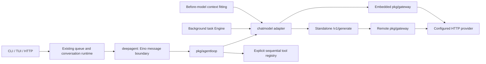

> 此文记录 `eba47cf` 的 Go 本地应用阶段。当前三服务 RPC 部署以 [services/README.md](../services/README.md) 和 [RPC 契约](../contracts/rpc-v1.md) 为准；旧服务命令和 Bearer 接线不适用于新端口。

# Native agent loop and model boundary

The interactive CLI, TUI and HTTP conversation runtime now execute `pkg/agentloop` through `internal/agent/deepagent`. There is no Eino agent loop behind that adapter. `internal/agent/chatmodel.New` selects an embedded gateway or the standalone gateway HTTP client, so the main model, context summary model and existing background task Engine all send model requests through `pkg/gateway` and `pkg/ai`.



## Loop contract

`agentloop.New(Config)` validates the client, positive `MaxSteps`, nonnegative `MaxDuration`, and tool definitions. `Run(ctx, ai.Request, emit)` owns its message history. Each tool has an `ai.Tool` definition and an explicit `Execute(ctx, ai.Block)` function; the complete call block includes its ID and arguments.

A successful assistant response passes through the synchronous `Commit` hook before any tool executes. Each tool result passes through `Commit` before the next tool or model. A hook error terminates execution. Deltas are provisional; neither a partial stream nor canceled context becomes a successful assistant commit. Tools run sequentially. Unknown tools, malformed JSON objects and ordinary execution errors produce explicit `tool_result` blocks with `IsError=true`; cancellation, deadlines and host-designated interrupts terminate the run.

The optional `BeforeModel` hook rewrites model context and tools. `Steering` is polled after each tool result and after a tool-free turn. Messages collected between tools are queued until the complete tool-result batch is present, keeping provider call/result pairing intact. The steering hook owns durable input admission if the host requires it. No steering is consumed after the final synthesis turn.

`MaxSteps` counts tool-enabled model turns. Once exhausted, one final model turn receives no tools and `ToolChoice=none`, with an instruction to answer from available evidence. Another tool request returns `ErrStepLimit` without executing it. `MaxDuration`, when nonzero, is a hard deadline for the entire run, including synthesis; an expired or canceled context returns an error. The application continues to use its existing run context and configured `agent.max_steps`.

## Actual persistence guarantee

The generic Commit hook guarantees ordering only to the durability provided by its caller. A host can use a transactional transcript append here; the library itself has no storage implementation.

The shipped application adapter calls `runtime.CaptureState`, which clones the in-memory context at each barrier. Its existing queued-run machinery persists the final successful context and raw turn transcript at the end of the run. This is **not per-model durable crash recovery**. A process crash between a tool side effect and end-of-run persistence remains subject to the existing runtime's recovery semantics. No database schema, migration, or historical-message rewrite is included.

## Context and observability

The before-model hook keeps the existing context measurement and fitting policy: shrink eligible skill/tool overhead and retain relevant dialogue. When fitting is insufficient or reported provider usage exceeds the budget, a separate tool-disabled summary model produces a checkpoint. Oversized or empty summaries fail before the main model runs. The raw transcript remains separate from this projected model context.

Model, tool, budget, compression and runtime spans retain their existing correlation. Tool recovery remains visible in telemetry. Provider token usage is retained on original Eino messages, so context budgeting still considers provider-reported usage. Gateway usage and configured cost, including whether they are known, are carried in response metadata.

## Eino boundary and streaming

Eino remains for `schema.AgenticMessage`, streams, tool interfaces, and the `adk.TypedAgent` iterator expected by the existing runtime/store. Summarization action types remain as UI event carriers. Existing safe-tool middleware helpers remain available and tested, but the production tool loop executes native registry functions. Eino's DeepAgent and the context-compression summary ChatModelAgent are no longer used. The separate `internal/usermemory` extraction and reconciliation operations each make one explicit tool-disabled completion through the same model gateway; they no longer construct an Eino agent.

`chatmodel.Adapter` converts common model options, roles, tool declarations, IDs, arguments, results, image blocks, reasoning and usage. Unsupported media/server-tool/deferred-tool capabilities fail explicitly. Native signed/encrypted continuation data is opaque `ai.Block.ProviderState`; it is copied unchanged through the loop and serialized in a JSON-stable Eino `Extra` carrier. Streaming terminal metadata carries this authoritative state even when deltas do not contain it. Legacy Eino reasoning extensions that cannot be mapped are rejected explicitly rather than dropped.

Streaming deltas are forwarded promptly. The adapter verifies that visible deltas agree with the authoritative final response, then sends metadata without duplicating the text or tool arguments. Stream errors remain errors; an upstream EOF without protocol completion is rejected by the gateway. The consumer must cancel the request context and close its reader when abandoning a stream. Eino's public stream API has no close callback, so closing a reader alone cannot immediately cancel a provider blocked before its next delta. Avoid closing an Eino reader twice.

## Model configuration

The default topology embeds `pkg/gateway` in the app and calls the configured provider directly. Existing `name`, `base_url`, `apikey: "{ENV_NAME}"` and `timeout` configurations continue to work. With no protocol, the adapter uses `chat_completions`; `base_url` appends `/chat/completions`, `/responses` or `/messages` according to the protocol. `endpoint` overrides that shorthand and is the complete URL.

```yaml
model:
  name: upstream-model-id
  protocol: anthropic
  endpoint: https://api.anthropic.com/v1/messages
  apikey: "{MODEL_API_KEY}"
  timeout: 120s
  parameters:
    max_tokens: 4096
  pricing:
    currency: USD
    input_per_million: 3
    output_per_million: 15
    cache_read_per_million: 0.3
    cache_write_per_million: 3.75
```

`parameters` accepts JSON-compatible provider parameters; `parameter_map` renames allowed parameter keys according to the gateway's validation. `subagent` accepts the same fields and otherwise inherits the main model configuration. Missing pricing means unknown cost, not zero cost. Custom JSON mappings are configured on the standalone gateway (for example the `custom` alias in `configs/ai-gateway.example.json`) and selected from application YAML through the remote topology below.

### Remote canonical gateway

Use `protocol: easygo` to connect the same CLI/TUI/HTTP application to a separately running `cmd/ai-gateway`. `endpoint` is the full generation URL, ending in `/v1/generate`; `base_url` is not a shorthand in this mode. `name` is the remote configured alias, and `apikey` resolves the gateway bearer token rather than the provider credential. Startup makes no discovery or model-list request.

```yaml
model:
  protocol: easygo
  endpoint: http://127.0.0.1:8090/v1/generate
  name: custom
  apikey: "{AI_GATEWAY_BEARER_TOKEN}"
  timeout: 120s
  streaming: false
  parameters:
    max_output_tokens: 4096
    top_p: 0.8
```

This selects the custom-mapping alias named `custom` on the remote gateway; its provider endpoint, credential, `parameter_map`, custom request/response mappings, and prices are defined in the gateway's JSON configuration. Application-side `pricing` and `parameter_map` are rejected for `easygo`. The app preserves the remote gateway's reported usage and cost.

`streaming` is accepted only for `easygo`. Omit it (or set it to `true`) for genuine incremental canonical SSE from remote aliases that support streaming. Custom mappings currently reject streaming, so their app configuration must set `streaming: false`. In this explicit mode the adapter sends exactly one non-streaming canonical request per model turn (`stream` omitted/false on the HTTP wire) and presents the completed response as one Eino message. It does not retry a failed stream or fabricate incremental provider output. Provider failures, timeout and caller cancellation still terminate the run.

Parameter precedence is: remote model defaults, then application YAML `parameters`, then per-request `chatmodel.WithParameters`, then explicit common model options such as max output tokens or temperature. The remote gateway performs provider field mapping. `timeout` and the caller's context bound the HTTP request, including streamed reads. `subagent` accepts the same remote settings; when omitted, it inherits the main model configuration.

## Evidence and reference influence

An earlier TypeScript agent implementation was read for reference only: its assistant barrier, tool-result barrier, steering, compaction and execution budget. The implementation follows the ordering and context-projection ideas, with no copied business code, compatibility layer, database design or execution budgets.

Tests cover native model/tool/model execution, multiple calls, barriers before side effects, recovered errors, cancellation, deadlines, steering, bounded synthesis, opaque-state ownership, adapter options, slow stream consumers, stream-to-JSON-to-next-request state retention, real local HTTP protocol translation, truncated SSE, and the production runtime's tool-result/final-persistence path. These providers are deterministic local fixtures, not live LLM calls. Existing agent/runtime/app/task/config tests remain in place.
