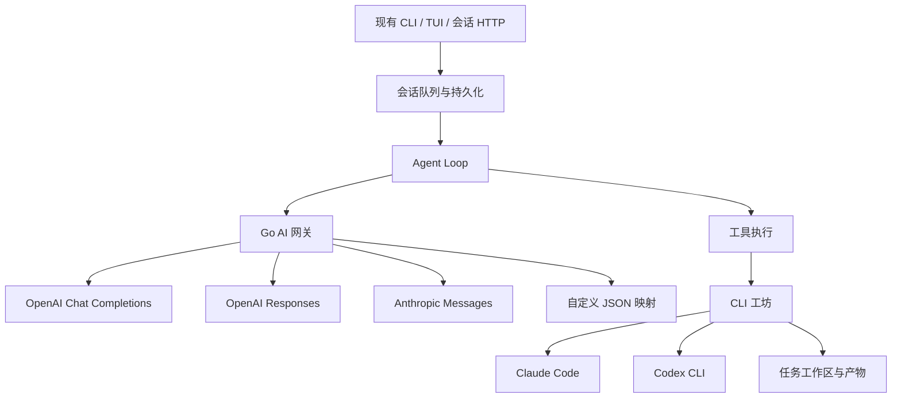

> 此文记录 `eba47cf` 的 Go 本地应用阶段。当前三服务 RPC 部署以 [services/README.md](../services/README.md) 和 [RPC 契约](../contracts/rpc-v1.md) 为准；旧服务命令和 Bearer 接线不适用于新端口。

# EasyGo：模型网关、Agent Loop、工坊

这次拆分把供应商协议、模型工具循环和 CLI 任务执行分开。每层有自己的入口和测试；修改供应商字段映射不需要修改工具循环，修改 CLI 参数不需要修改模型网关。

## 三层职责

| 层 | 负责 | 依赖方向 |
|---|---|---|
| AI 网关 | 模型别名、URL、参数映射、流式协议、用量、配置计价、请求观测 | 只依赖 EasyGo 模型协议和 HTTP |
| Agent Loop | 模型→工具→模型循环、消息提交顺序、上下文处理、取消和步数上限 | 依赖 `ai.Client` 和工具函数 |
| 工坊 | 工作流快照、任务队列、CLI 子进程、原生会话续跑、事件和产物 | 依赖操作系统进程与任务存储 |

`pkg/ai` 是 EasyGo 自己的消息和模型调用格式。调用者提供消息块、工具定义和模型别名；网关返回消息、停止原因、用量和成本。`ai.Client.Complete` 只执行一次模型调用，非空回调接收增量。增量是临时输出；只有成功返回的完整响应才代表本次调用完成。

输入 token 的归一值包含缓存读写，缓存数量作为子集列出。计价时将普通输入与缓存分开，避免重复收费。没有供应商用量或没有配置价格时，成本是未知，不能写成免费。价格由操作者配置，不在代码里声称某个厂商的当前价格。

CLI 工坊的底层引擎已有自己的模型工具循环。因此外层 Loop 向它提交任务并查询结果，不再替 CLI 重做内部循环。CLI 的模型连接由其操作者配置，不能把 EasyGo 的 `/v1/generate` 当作 OpenAI 或 Anthropic 兼容端点直接填给 CLI。

## 参考实现与取舍

阅读的源码固定在以下版本，参考仓库未作业务修改：

- EasyGo 基线：`95131f1`。现有会话队列、历史、长期记忆、后台任务、沙箱和 TUI 都是本次集成需要保留的能力。
- reference agent A：`<reference revision>`。`<reference agent loop>` 的 `ensureAssistantBarrier`、`beforeToolCall`、`shouldStopAfterTurn`、`getSteeringMessages` 展示了模型输出先记录、工具结果记录后推进、工具间隙接收输入的顺序。借鉴执行顺序与可观测性，不复制 Cloudflare Durable Object、业务确认、旧 transcript 重建和业务工具兼容逻辑。
- reference runner C：`<reference revision>`，源码在 `master`；其 `main` 是占位 README。`<reference runner>`、`subprocess_runner.py`、`activity.py` 展示了引擎参数数组、JSONL 事件、原生 session/thread ID、续跑与工作区管理。借鉴这些职责，不复制生产机器部署与历史引擎配置兼容层。

供应商协议参考 [OpenAI function calling](https://developers.openai.com/api/docs/guides/function-calling) 和 [OpenAI streaming](https://developers.openai.com/api/docs/guides/streaming-responses)。完整适配范围、配置和限制分别见各层文档。

## 验收原则

协议测试必须穿过本机 HTTP 服务，验证真实请求字段、分片和错误行为。Loop 测试必须证明工具调用后的结果进入下一次模型请求，并证明提交失败会阻止后续副作用。工坊测试必须启动真实子进程，验证参数、标准输入、取消、超时和续跑。

这些测试使用本机供应商响应与 CLI 事件夹具，不等同于对真实付费模型的线上验收。PostgreSQL 和 Docker 的集成验证需要独立记录是否启用，不能把默认跳过当作通过。
