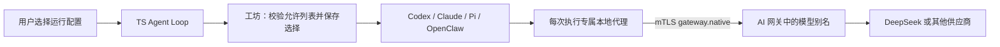

# 选择 Agent 框架与模型

更新：已完成 DeepSeek 真实 API、四框架续跑与文件工具验收，见 [真实接口验收](deepseek-live-verification.md)。下文初轮夹具测试范围保留用于区分证据。

工坊新增运行配置层。调用方只选择管理员公布的配置 ID；一个配置明确绑定框架、模型路由及协议。工作流可允许多个配置，例如同一个写作任务选择 `pi-main`、`openclaw-main`、`codex-responses` 或 `claude-messages`。不同模型可以再配不同 ID，不需要更换 Agent Loop。

部署仍是网关、TS Loop、工坊三个服务。Codex、Claude Code、Pi、OpenClaw 在工坊里作为子进程运行，OpenClaw 使用 `agent --local`，不再启动一个公开 Gateway。



## 第三方 API 支持

以下是当前文档与本次实测版本的结论，不代表任意版本或任意兼容 API 都可混用。

| 框架 | 原生模型协议 | DeepSeek 接法 | 本机真实 CLI 验证 |
|---|---|---|---|
| Codex 0.157.1 | Responses | DeepSeek 原生 `/responses` | 首次调用及同会话续跑通过 |
| Claude Code 2.1.281 | Anthropic Messages | DeepSeek `/anthropic/v1/messages` | 首次调用及同会话续跑通过 |
| Pi 0.87.1 | OpenAI Chat / Responses、Anthropic | 可选 DeepSeek Chat 路由 | Chat 首次调用及同会话续跑通过 |
| OpenClaw 2026.9.6 | OpenAI Chat / Responses、Anthropic | 可选 DeepSeek Chat 路由 | Chat 首次调用及同会话续跑通过 |

四项真实 CLI 测试使用本机假模型服务器、临时 HOME 和假密钥，证明配置、请求格式、结果解析与会话续跑。没有用真实密钥请求 DeepSeek；模型质量、供应商全部工具能力与全部协议组合不在这次证明范围。框架订阅和 API 消费是不同的计费来源；切换到自己的 API 配置仍需承担所选供应商费用。

DeepSeek 已正式提供 [Codex Responses 接入指南](https://api-docs.deepseek.com/quick_start/agent_integrations/codex/)和 [Claude 接入指南](https://api-docs.deepseek.com/quick_start/agent_integrations/claude_code/)。Codex 自定义供应商要求 Responses，见 [官方配置](https://learn.chatgpt.com/docs/config-file/config-reference)。Pi 与 OpenClaw 的其他协议来源及版本证据见 [兼容性研究](runtime-provider-compatibility.md)。

## 复用主 Agent 的模型

推荐采用 `gateway_model`：它引用与主 Loop 相同网关内的模型别名，供应商密钥只在网关解析。工坊为每次执行启动仅监听 loopback 的本地代理，生成独立的随机临时令牌，再通过工坊自己的 mTLS 身份调用 `gateway.native`。框架配置文件只写临时令牌的环境变量引用，不复制主 Agent 的私钥、用户 HOME、OAuth 登录或历史。

代理固定 namespace、模型别名和生成接口；子进程传入的模型不能改写网关的上游模型。调用方不能用任务参数指定 URL、命令、环境或凭证。只有工作流默认配置和 `allowed_runtimes` 中的配置可选。供应商 URL 和认证只来自管理员配置。

`gateway.native` 保留框架原生消息和工具格式；它不把 Chat Completions 猜测转换为 Responses。配置声明的协议必须和网关路由匹配。当前原生 SSE 在网关有界缓冲后返回，最多 8 MiB；不是逐 token 实时透传。JSON、SSE 终态及错误经过校验，已知非法或截断响应不会作为成功交给框架。网关沿用配置参数映射、用量和费用观测；暂无法解析的原生扩展工具不会被标成已知免费。

可用的四框架示例：

```bash
cp services/ai-gateway/config.deepseek.example.json services/ai-gateway/config.local.json
cp services/workshop/config.runtimes.example.json services/workshop/config.local.json
export EASYGO_GATEWAY_CONFIG=./services/ai-gateway/config.local.json
export EASYGO_WORKSHOP_CONFIG=./services/workshop/config.local.json
# 在凭证环境中设置 DEEPSEEK_API_KEY；不要把值写进 JSON。
scripts/dev-pki.sh ./state/pki  # 仅首次生成，拒绝覆盖已有目录
docker compose -f compose.services.yaml up --build -d
```

网关示例将 `chat`、`responses`、`claude` 配为 DeepSeek 的对应原生接口，主 Loop 默认也用 `chat`。Pi/OpenClaw 的 `*-main` 配置直接复用该别名。Codex/Claude 分别引用同一供应商模型的另一种协议路由。需要其他模型时，在网关增加路由，再增加运行配置并加入工作流允许列表。

也支持直连配置：`engine`、`protocol`、`model`、`base_url`、`api_key_env`，与 `gateway_model` 互斥。`base_url` 是框架使用的 API 基地址，而网关 `endpoint` 是完整生成接口地址。直连密钥需由操作者明确注入工坊；只把选定密钥交给该子进程，运行配置模式不继承旧 `env_allowlist` 的其他值。直连调用不经过主网关计价。工坊保存原生 CLI 的 usage 口径：本次 Codex 续跑返回会话累计用量，不能把各次续跑数直接相加当成新增费用；网关模式按每次实际模型请求的网关观测计量。

## 用户 API

使用既有 mTLS 客户端调用：

1. `agent.workshop.catalog`，参数 `{"namespace":"demo"}`：返回工作流及可选配置，只有 ID、框架、模型别名、协议、来源等非秘密元数据。
2. `agent.run.start` 可增加 `workshop_runtime`：

```json
{
  "namespace": "demo",
  "session_id": "创建会话返回的 ID",
  "input": "写一份说明并保存到 note.md",
  "idempotency_key": "request-001",
  "workshop_runtime": "pi-main"
}
```

用户指定的配置会覆盖模型在 `workshop_submit` 工具参数中提出的其他选择。未指定时，模型可从工作流目录选择 `runtime`，或使用工作流默认配置。已有客户端继续可用。直接调用工坊时，`workshop.submit` 的可选字段是 `runtime`，需要该方法的 mTLS 授权。

Loop 保存 `workshop_runtime`，相同幂等键更换选择会冲突。工坊同一 key 明确更换配置也会冲突；重复请求省略配置时返回原任务，不因管理员修改默认值而启动另一任务。任务摘要和列表显示已选择的 `runtime`、`engine`、`model`。

框架、模型、直接路由的非秘密参数随任务保存，续跑保留原选择与原生会话，不能中途改框架。密钥只保留环境变量引用，允许轮换。网关模式保存的是别名，别名后端仍由网关集中管理，修改网关映射会影响后续调用；需要固定模型版本时使用独立别名。已保存任务不会因配置从目录删除就自动撤销，需取消任务或撤销相应引擎/网关权限。

## 执行和验证边界

每个任务有自己的工作目录、HOME 与原生会话目录；取消/超时终止进程组。保留变量不能被环境白名单覆盖。Pi 只启用明确的文件工具，并关闭扩展、技能和项目配置发现；OpenClaw 禁用插件并启用文件工具允许列表与 workspaceOnly。**这些不是每任务独立的 OS 沙箱**，尤其 Pi 的文件工具可使用进程权限访问路径。现有部署适用于可信工坊环境；独立容器/VM 隔离仍由部署层提供。

工坊镜像改用 Node 26，匹配 OpenClaw 的运行要求；四个 CLI 版本固定。TS Loop 镜像仍用 Node 22。本机没有 Docker Engine，Compose 配置解析通过，镜像构建/容器运行未执行。

复跑普通检查：

```bash
(cd services/ai-gateway && go test -race ./... && go vet ./...)
(cd services/workshop && go test -race ./... && go vet ./...)
npm --prefix services/agent-loop ci
npm --prefix services/agent-loop run typecheck
npm --prefix services/agent-loop test
EASYGO_GO_BIN=/path/to/go node scripts/test-services.mjs
```

真实 CLI 测试需额外设置 `WORKSHOP_NATIVE_CODEX`、`WORKSHOP_NATIVE_CLAUDE`、`WORKSHOP_NATIVE_PI`、`WORKSHOP_NATIVE_OPENCLAW` 为绝对可执行路径，再运行 workshop 包的 `TestNativeRuntimeDirectAndResume`。这些路径未设置时该项显式跳过；普通夹具测试不能替代真实 CLI 验证。OpenClaw 原生测试中出现后台 SQLite maintenance 诊断，首次及续跑结果、session ID 和进程退出均通过，未把该诊断藏成“无告警”。

施工与独立审查闭环记录见 [crew 验收](crew/runtime-a928/closure.md)。
