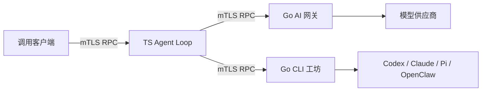

# 三个独立服务

三个服务可以分别部署，运行时只通过 JSON-RPC over HTTPS 通信。每个服务有独立身份、配置和镜像，Agent Loop 与工坊分别持有自己的数据卷。[RPC 契约](../contracts/rpc-v1.md)列出请求、响应和授权规则。

| 目录 | 语言 | 默认端口 | 持久数据 |
|---|---|---|---|
| `ai-gateway` | Go | 8441 | 无本地业务数据库 |
| `agent-loop` | TypeScript / Node 22.23+ | 8442 | `/data/agent.sqlite` |
| `workshop` | Go + 已安装的 CLI 引擎 | 8443 | `/data/workshop` |

`packages/rpc-go` 是两个 Go 服务共用的源代码库，不单独部署。镜像构建上下文是仓库根目录；每个运行镜像只保留自己的程序和运行依赖。



## 公钥、私钥与权限

每个身份拥有自己的私钥和公钥证书。服务端要求 TLS 1.3 双向认证：先验证证书链，再匹配实际叶证书的 SHA-256 指纹，最后检查 RPC 方法和 namespace 权限。客户端也检查 CA、主机名和指定的服务端证书。HTTP Header 或 RPC 参数不能替代证书自报身份。

`authorization` 中只有显式的 `*` 才代表全部；默认 `client` 只能调用 Agent API，namespace 是 `demo`。Loop 以自己的身份调用网关和工坊。`/healthz` 也要求 mTLS 和 `health` 权限，默认只授予相应服务身份。

```bash
scripts/dev-pki.sh ./state/pki
```

脚本拒绝覆盖已存在目录，生成各自的 `tls.crt`、`tls.key` 和公共 `public/*.crt`。CA 私钥位于 `.ca/ca.key`。开发叶证书有效期为 7 天，CA 为 30 天。生产可用自己的 CA 签发证书，配置相同路径即可；更换服务端证书时同时更新调用方的固定证书配置，替换后重启服务。

容器只读挂载自己的身份目录和公共 trust 目录；不挂 `.ca`、其它身份的私钥、Docker socket 或操作者 HOME。镜像以 UID/GID 1000 运行，身份目录的所有权应允许这个 UID 读取，私钥保持 `0600`。生成的 `state/` 已被 Git 和 Docker 构建上下文忽略。

选择四种框架、复用主网关模型及 DeepSeek 示例见 [运行配置说明](../doc/workshop-runtimes.md)。工坊 CLI 镜像使用 Node 26；TS Loop 仍用 Node 22。

## 配置与启动

先复制示例，再填入实际模型 ID、保留需要的模型路由和工作流：

```bash
cp services/ai-gateway/config.example.json services/ai-gateway/config.local.json
cp services/agent-loop/config.example.json services/agent-loop/config.local.json
cp services/workshop/config.example.json services/workshop/config.local.json
export EASYGO_GATEWAY_CONFIG=./services/ai-gateway/config.local.json
export EASYGO_AGENT_CONFIG=./services/agent-loop/config.local.json
export EASYGO_WORKSHOP_CONFIG=./services/workshop/config.local.json
# 从自己的凭证环境导出所用模型的 OPENAI_API_KEY 等变量。
# 使用 Codex 工作流时另行导出 CODEX_API_KEY。
docker compose -f compose.services.yaml up --build -d
```

不要把密钥值写进配置。网关配置引用的凭证环境变量缺失时，服务启动会失败；删除未使用的模型配置后就不必提供对应密钥。自定义 JSON 模型不支持增量流，使用该模型别名时将 Loop 的 `streaming` 设为 false。

| 宿主变量 | 注入位置 | 用途 |
|---|---|---|
| `OPENAI_API_KEY`、`ANTHROPIC_API_KEY`、`CUSTOM_API_KEY` | 网关 | Loop 的模型调用 |
| `CODEX_API_KEY` | 工坊及其 Codex 引擎 allowlist | 非交互 Codex 认证 |
| `WORKSHOP_ANTHROPIC_API_KEY` | 工坊中的 `ANTHROPIC_API_KEY` | 配置 Claude 引擎后使用 |

Codex 的非交互运行支持 `CODEX_API_KEY`，见 [官方非交互文档](https://learn.chatgpt.com/docs/non-interactive-mode)。示例只启用 Codex；要使用 Claude，添加对应工作流和 `engines.claude`，并在它的 `env_allowlist` 中列出需要的凭证变量。

Compose 默认项目名 `easygo-rpc`，宿主端口只绑定 `127.0.0.1`。可通过 `EASYGO_GATEWAY_PORT`、`EASYGO_AGENT_PORT`、`EASYGO_WORKSHOP_PORT` 改映射端口；用 `-p` 启动另一套部署时，卷会自动按项目隔离。容器之间使用服务名和固定容器端口，不能使用宿主的 127.0.0.1。

## RPC 调用

创建会话：

```bash
node scripts/rpc-call.mjs \
  --url https://127.0.0.1:8442/rpc \
  --cert state/pki/client/tls.crt --key state/pki/client/tls.key \
  --ca state/pki/public/ca.crt --peer state/pki/public/agent-loop.crt \
  --method agent.session.create --params '{"namespace":"demo"}'
```

随后将方法改为 `agent.run.start`，params 提供 `namespace`、返回的 `session_id`、`input` 和稳定的 `idempotency_key`。启动返回 queued/running 资源；用 `agent.run.get` 或 `agent.run.events` 查询完成状态。相同会话内的同一 key 和相同输入返回同一 run，改变输入则冲突。

客户端不会自动重试写操作。工坊任务接受不等于完成；Loop 使用工坊查询与结果分页工具核实产物。完整方法表见契约。运维健康检查可使用 `--health`，但要选择被授予 health 的身份，例如 agent-loop 自己的证书和私钥。

## 数据与退出

Agent 数据库在 `/data/agent.sqlite`，工坊库、任务工作区和 CLI 原生会话在 `/data/workshop`。CLI 默认 HOME 是任务目录下的 `.workshop-home`，因此会随工坊数据卷保留；示例不覆盖它，也不共享操作者的 CLI 家目录。

每个数据卷只运行一个对应服务实例。TS 服务使用所有权租约和写入 fencing，正常停止释放租约；进程被强杀后，新实例须等待最多约 30 秒租约过期。已有 running 运行标为 interrupted，不自动重放工具副作用。工坊使用数据库独占锁，也不自动重放中断任务。

先停止服务再备份各自的卷。默认卷名为 `easygo-rpc_agent-data` 和 `easygo-rpc_workshop-data`；指定 `-p` 时使用相应项目前缀。`docker compose -f compose.services.yaml down` 保留数据卷，`down -v` 会删除它们。

镜像预置了 UID 1000 可写的 `/data`；新空卷默认采用 Docker 的初始内容复制机制，已有卷则保留自身内容与权限，参见 [Docker 卷文档](https://docs.docker.com/engine/storage/volumes/)。恢复外部备份或使用绑定目录时，请核对所有权，而不是假设镜像里的 chown 会改变已有数据。

## 验证与边界

`node scripts/test-services.mjs` 会实际构建并运行三个本机进程，使用临时 mTLS 证书、本机模型响应夹具和真实 CLI 子进程夹具，验证调用链、越权拒绝、取消和崩溃恢复。先在 `services/agent-loop` 执行 `npm ci`；Go 不在 PATH 时设置 `EASYGO_GO_BIN`。

上述三进程脚本不启动 Docker 容器，也不调用付费模型；下方 Harness 场景使用专用 Docker daemon 验证任务容器。运行时镜像的 Node 22 标签会检查最低版本，CLI 安装版本在工坊 Dockerfile 中固定。

新 TS 数据库不会自动迁移原 Go 会话库。原 Go 本地应用仍保留作为过渡和回归入口，新的部署主链不依赖它。mTLS 与 namespace 是 RPC 访问控制，不等同于每任务独立的 OS 沙箱；CLI 工作流仍受工坊配置和 CLI 自身执行策略约束。

## P1 Harness 场景

`scripts/test-harness.mjs` 默认运行九个场景：

| 场景 | 验证内容 |
|---|---|
| S1 | report / ask / report / submit 顺序、唯一 ID、重读与游标 |
| S2 | 静默退出的 outcome=none |
| S3 | 坏产物被检查拒绝、自报通过被标为 false_green、失败输出可读 |
| S4 | 好产物通过检查，独立遍历工作区重算 workspace_sha256 |
| S5 | 施工者改不到受信检查程序；检查容器的工作区和 pack 只读、不能连网、没有凭证或 relay |
| S6 | 提问后回复并续跑，输入含回复 ID，消息被记为已读 |
| S7 | 运行中的施工者从 inbox 收到回复后再 submit |
| S8 | 重复 client_id 只产生一条消息 |
| S9 | 检查容器实际运行期间取消，acceptance=cancelled，无残留检查容器 |

每个场景经过本机模型夹具、真实网关和 loop、工坊任务容器及 crew 通道；断言读取持久化工具结果和工坊 RPC 数据。验收输出通过 loop 工具分页读取，并和工坊 RPC 全文比较。S4 的 JavaScript 实现独立扫描文件，保存目录条目与哈希，不调用工坊的哈希函数，排除 `.workshop-home`。

先安装 loop 依赖，使用专用 Docker daemon 构建当前代码的夹具镜像，再执行：

```bash
export EASYGO_GO_BIN=/path/to/go
export EASYGO_DOCKER_TEST_BINARY=/path/to/docker
export EASYGO_DOCKER_TEST_ENDPOINT=unix:///path/to/dedicated/docker.sock
export EASYGO_DOCKER_TEST_IMAGE=easygo-sandbox-fixture:acl-loop

"$EASYGO_DOCKER_TEST_BINARY" -H "$EASYGO_DOCKER_TEST_ENDPOINT" build \
  --network host -f deploy/runtime/Dockerfile.fixture \
  -t "$EASYGO_DOCKER_TEST_IMAGE" .
node scripts/test-harness.mjs --evidence /tmp/harness-run-1
node scripts/test-harness.mjs --evidence /tmp/harness-run-2
```

`--evidence` 必须指向尚无 `report.json` 的目录。可加 `--scenarios S3,S4,S5,S9` 选择场景子集；未选场景在报告的 deferred 中列出，不会被记作通过。镜像需要包含当前 fixture-cli（支持 `echo_input` 和 `write-denied`）与 fixture-check。脚本另行静态编译 fixture-check 放进临时受信 pack，用于验证实际执行的是只读 pack 中的检查程序。

脚本只用随机假凭证，自动生成临时 mTLS 证书，不读取真实模型凭证。任务与验收串行运行，容器限额为 64 MiB 内存、0.1 CPU、128 PID 和 1 MiB `/tmp`；编译使用单个 Go 构建任务。PID 使用运行时默认值：配置下限 16 并不保证能运行 task-shim、CLI 和 easygo-crew 三个 Go 进程。场景证据、构建及服务日志、代码与脚本哈希、退出状态保存在指定目录。服务停止后只解除本次 state 目录的封存权限并清理，不触碰其它任务。失败退出码非 0，详情见 `report.json` 和对应场景 JSON。
